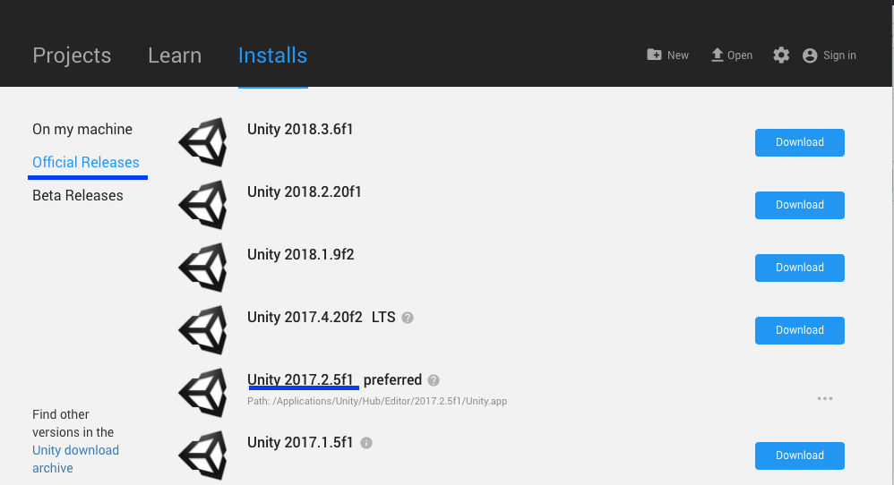
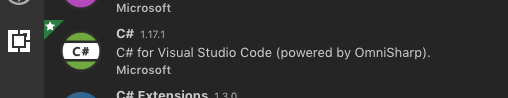

# Getting Started

## First 

Download [Unity Hub ](https://unity3d.com/get-unity/download)

When that is downloaded, it will act as the version manager for the Unity Game development environment. Download version `2017.2.5.f1`

## Second

Download [Visual Studio Code](https://code.visualstudio.com/) from Microsoft.

When it's downloaded follow the Instructions [HERE](https://code.visualstudio.com/docs/other/unity) to sync Visual Studio with Unity

## Third

In Visual Studio Download the `C#` Extension

## Fourth

Download the github app and watch a tutorial video on what git is and how to use the app.
